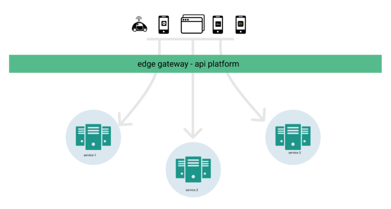
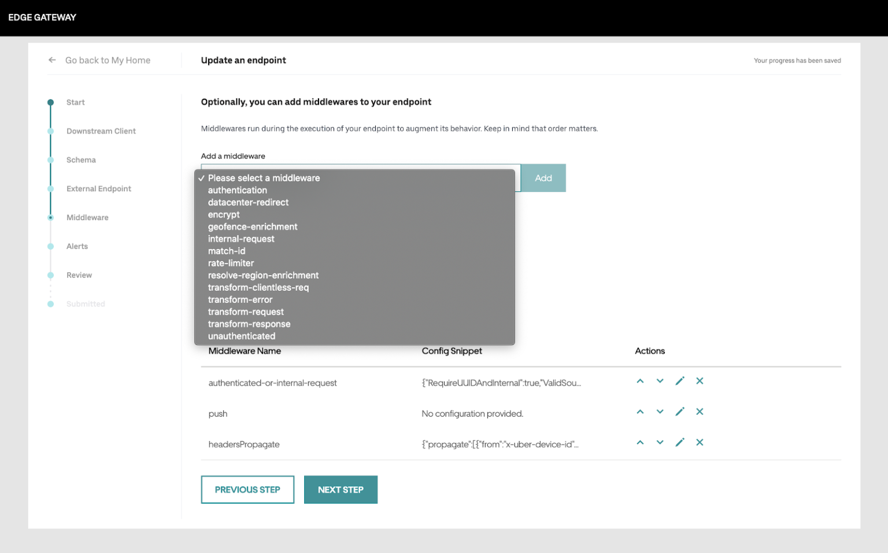
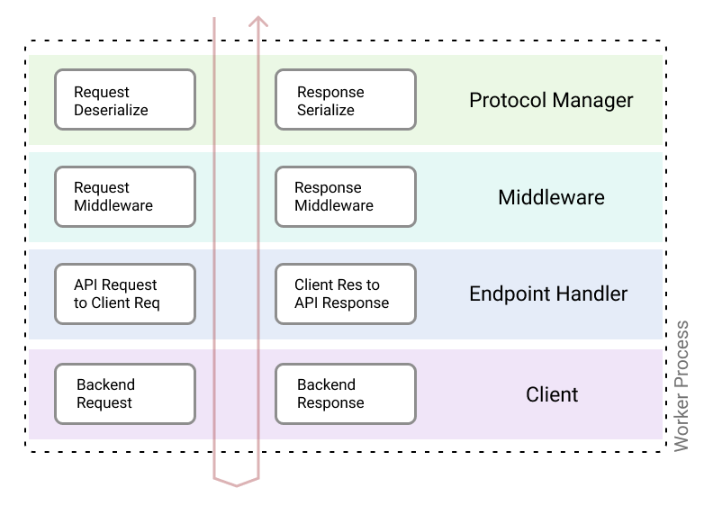
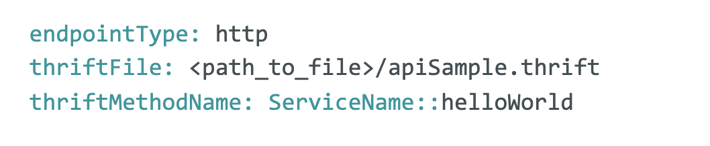
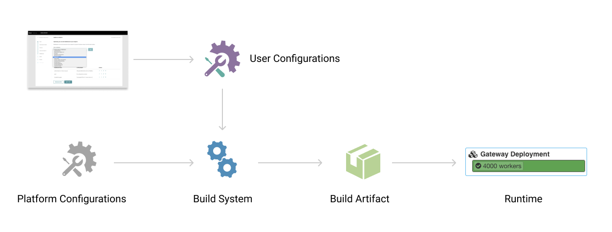

# Uber 系统设计之 API Gateway
https://eng.uber.com/architecture-api-gateway/  
  
  

API Gateway 是所有后端微服务（数据访问、逻辑、功能等服务）的入口。  
API Gateway 还包括路由、协议转换、限流、负载卸载、标头丰富和传播、数据中心关联实施、安全审计、用户访问阻止、移动客户端生成等。  
最简单的 API Gateway 主要作为负载均衡。但是 Uber 的 API Gateway 设计得功能更加丰富 - 对不同协议上输入输出数据进行操作。

## API Management
丰富的功能是通过与多种功能的服务交互实现的，这些交互需要通过一个共同的应用 Gateway 层。API Management 就是创建、编辑、删除、版本化这些 Gateway API。  
  
工程师在 UI 上配置 API 的参数并对外发布这些功能性 API。这些配置决定了 API 的：路径、请求数据、返回数据类型、最大调用限制、允许的 app、通讯协议、调用的具体微服务、允许的 header、可观测性、字段匹配确认等等。  
一旦配置发布，Gateway 基础设施就生成相应的 API 及客户端 SDK。  
  
这个 Gateway 系统交互的 UI 包括一系列操作来创建 API，包括强制设置一些 API 属性，另外还包括设置请求超时、监控、警报等等。  
这个管理系统还包括辅助功能如在发布前 review 创建、更新的 Gateway  
  
  
## 请求生命周期上的 API Gateway 组件
请求总是包括路径信息，以匹配一个 handler 来服务它。请求流通常经过这些组件：protocol manager，中间件（Middleware），数据校验，handler，以及一个后端客户端。这些请求生命周期中的组件以一个栈为单位的组来实现。  
这些组件在输入输出的过程中起作用，且其执行顺序在输入、输出过程中相反（比如输入第一则输出最后）。
  
### Protocol Manager（协议管理器）
栈的第一层，它为支持的每个协议提供了一个反序列化器和一个序列化器。该层使 API 有能力读取任何类型的相关协议有效负载，包括 JSON、Thrift 或 Protobuf。它还可以方便地接收传入的 JSON 请求并使用 proto 编码进行响应。  
  
### 中间件（Middleware）
中间件层是在调用 endpoint handler 程序之前实现了可组合逻辑的抽象。中间件实现了横切关注点，例如身份验证、授权、速率限制等。每个 endpoint 都可以选择配置一个或多个中间件，除了可选的中间件外，平台通常还包括一组强制中间件，这些中间件始终针对每个请求执行。单个中间件不一定总是同时实现 requestMiddleware 和 responseMiddleware 方法，因为如果某个中间件执行失败，调用会短路栈的其余部分，即该中间件的响应将直接返回给调用者。在某些情况下，中间件可以是无操作的，具体取决于请求的 context。  

### Endpoint Handler
Endpoint handler 程序是负责请求验证、有效负载转换以及将 endpoint 请求对象转换为客户端请求对象的层。在对响应对象进行操作时，endpointHandler 将后端服务响应转换为 endpoint 响应，对响应对象执行任何转换 - 基于 schema 和序列化的响应校验。  

### 客户端
客户端执行对后端服务的请求。客户端是协议感知的，并根据配置期间选择的协议生成。用户可以配置客户端的内部功能，例如请求和响应转换、schema 校验、断路和重试、超时和期限管理以及错误处理。  
  
  
  
## 配置组件
协议管理器、中间件、handler 和客户端有许多可以使用配置来控制的行为。管理 API 的用户无需修改任何代码，而只是配置以确定网关处的预期 endpoint 行为。为了便于配置，这些通过 UI 进行管理并由 Git repository 提供支持。  
每个组件的配置都在 Thrift 和/或 YAML 文件中读取。YAML 文件为组件提供信息并充当它们之间的一种粘合剂。Thrift 文件定义了负载（payload）和协议语义。  
网关 thrift 文件大量使用 thrift IDL 中的注释特性，以便为各种特性和协议提供 single source of truth。  

### 每个组件的配置

#### Protocol Manager（协议管理器）
...
  
...

#### ...
// ToDo ... （当前不重要）

### Runnable Artifact（Runnable Artifact）
所有组件的 YAML 和 Thrift 配置对于完整描述一个 API 配置是必要的。自助网关负责确保将这些组件配置组合在一起以提供网关运行时。  
  

网关有两种风格：一种采用配置并基于它们动态提供 API（如 kong、tyk 和反向代理，如 envoy、Nginx）；另一个基于输入配置并通过代码生成步骤生成构建工件。在 Uber，选择了后一种代码生成方法来创建可运行的构建工件。  
  
## 功能介绍
集中式系统的一个优势是构建可以使所有已注册用户受益的功能。借助 Edge Gateway 等功能丰富的网关，可以通过多种途径构建功能，所有访问 Uber 内部服务的 API 都可以利用这些功能。  
以下是一些已经开发的功能示例，以及一些仍在开发中的功能示例。  

审计管道  
Edge Gateway 记录包含丰富元数据的访问日志，这些元数据被持久化以供审核，这对维护所有产品的所有 API 访问模式的审计记录至关重要。如果恶意行为者尝试使用自动化系统访问 Uber 的 API 时，可以通过它们进行安全审计，并且帮助构建跨版本、地理和应用程序的各种产品的 profile。  
此管道有助于跨特定 SDK 版本、应用程序、地理位置或 Internet 提供商地快速捕获错误、问题和异常。Uber 所有的应用程序都启用了审计管道。  

验证  
每个外部 API 请求都经过身份验证 (AuthN) 和/或授权 (AuthZ)。平台为 AuthX 中间件提供了几个可重用的实现。这消除了对如何实现这些 AuthN/AuthZ 的担忧并强制 endpoint 使用至少一个提供的实现。平台所有者可以无缝地对这些实现进行更新，这些更新将自动应用于所有 endpoint。  

断路  
用于调用后端服务的每个客户端都包含一个断路器。每当后端服务遇到延迟或错误率增加（可配置）时，断路器就会启动，以防止任何级联错误。这也为恢复已经恶化的服务提供了空间。  

速率限制  
端点所有者可以选择对 API 进行速率限制。提供的实现的一些示例是基于用户 ID、用户代理、IP、请求的某些属性的组合等的速率限制。可以基于来自路径或查询参数、标头、正文的特定字段来实施限制。这允许灵活地提供比简单的用户级 API 访问更精细的 application-aware 速率限制策略。每个 endpoint 都可以独立地动态分配配额，且无需重新部署。  

文档  
YAML 和 Thrift 中的所有配置足够完整描述一个 API。这提供了以一致方式为所有网关 API 自动生成文档的选项。  

移动客户端生成  
Uber 的所有移动应用程序都基于 Thrift IDL 生成服务和模型以与服务器交互。CI 作业从网关获取所有 endpoint IDL，并为不同模型运行其自定义代码生成。移动代码生成还依赖于各种自定义 Thrift 注释，例如异常状态代码、URL 路径和 HTTP 方法。针对生成的代码审查运行的 CI 作业会阻止对 endpoint schema 的任何向后不兼容的更改。  

响应字段修剪  
由于 API 的创建很容易，并且多个 endpoint（端点）可以由相同的底层客户端服务支持。可以有能力创建 API 来精细选择用户体验所需的特定字段，而不是使用后端响应的完整大小进行响应。  

数据中心亲和力  
拥有冗余数据中心和区域是当前大型网络公司的实际架构。属于不同业务部门或域的 API 托管在网关上，每个业务部门可以定义跨多个数据中心的工作负载分片。Edge Gateway 提供了一个缓存，业务部门可以写入该缓存以配置用户、区域或版本与相应数据中心的关联性。然后，网关将通过根据数据中心关联信息来确保重新路由来自特定用户、设备或应用程序的传入 API。  

短期用户禁令  
帐户级别的禁令是对付恶意行为者的锤子。对于暂时滥用系统的用户，网关提供了一个中心位置，用于在短时间内阻止特定用户的 API 访问。这种方法类似于数据中心关联，其中网关可以提供外部缓存来存储具有 TTL 的被阻止用户。欺诈和安全系统可以提供用户、应用程序版本或其他标识符以进行阻止。Edge 网关将确保执行这些短期禁令以保护用户。  

## 挑战和教训
在网关的开发过程中，不得不在设计的多个方面做出选择。简要介绍其中的一些挑战。  
* 编程语言
* 序列化格式
* 配置存储
* 网关用户界面
* 了解有效载荷
  
这些挑战揭示，功能丰富的网关是一项复杂的工作。  
