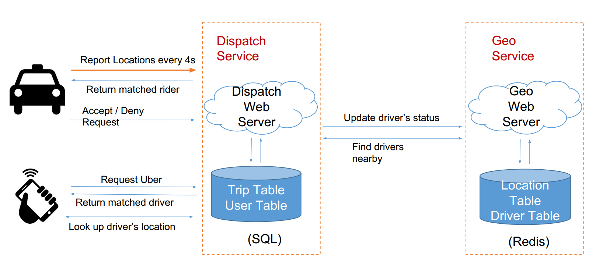

# Uber 系统设计
引用：https://jiayi797.github.io/2018/01/21/%E7%B3%BB%E7%BB%9F%E8%AE%BE%E8%AE%A1-%E8%AE%BE%E8%AE%A1Uber/  
  
**得分点 Checklist：**  
* Weak（完成以下）
    * 分析出 Uber 是写密集型应用（与大部分应用是读密集型不一样）
    * 解决 LBS 类应用的核心问题（Geohash / Google S2）
        * 如何存储 Driver 的地理位置
        * 如何查询乘客周边的车
* Hired（完成以下）
  * 分析出一个 Work Solution，说明整个打车流程
  * 分析出按照城市进行 Sharding
  * 知道如何做 Geo Fence 的查询
  * 通过分析选择合适的数据库
  * 考虑到单点失效（多机）与数据故障（备份）如何解决
* Strong Hired（完成以下）
  * 深入理解 NoSQL DB 的实现以及 Ring Pop 的实现（读论文 http://bit.ly/1mDs0Yh ）
  * 设计 Uber Pool / Uber East

  
## Scenario 场景
需要设计哪些功能？设计到什么地步？  

* 第一阶段
    * Driver report locations 司机报告自己的位置—— heart beat 模式
    * Rider request Uber, match a driver with rider 乘客叫车，匹配一辆车
* 第二阶段
    * Driver deny/accept a request 司机取消/启动 接单
    * Driver cancel a match request 司机取消订单
    * Ride cancel a request 乘客取消请求
    * Driver pick up a ride/ start a trip 司机接人
    * Driver drop off a rider/end a trip 司机送到人
* 第三阶段
    * Uber Pool
    * Uber Eat

### QPS / Stroage
假设 20w 司机同时在线：  
Driver QPS = 200k/4 = 50k，每次汇报200k个请求，每4秒汇报一次；这个占大头  
Peek Driver QPS = 50k x 3 = 150k  
Rider QPS 可以忽略：不用随时汇报位置，一定远小于 Driver QPS  

## Service 服务
Uber 主要干的事情就两件：  
* 记录车的位置：GeoService
* 匹配打车请求：DispatchService

Driver 如何获得打车请求？—— Report location 的同时，服务器顺便返回匹配上的打车请求，基本纲要：  
* 司机向 dispatch service 发送位置信息，同时返回匹配的乘客信息  
* 乘客向 dispatch service 发送打车请求，同时返回请求  

### 具体打车流程 Work Solution（重点）  
1. 乘客发出打车请求，服务器创建一次 Trip
    1. 将 trip_id 返回给用户
    2. 乘客每隔几秒询问一次服务器是否匹配成功
2. 服务器找到匹配的司机，写入 Trip，状态为等待司机回应
3. 同时修改 Driver Table 中的司机状态为不可用，并存入对应的 trip_id
4. 司机汇报自己的位置
5. 顺便在 Driver Table 中发现有分配给自己的 trip_id
6. 去 Trip Table 查询对应的 Trip，返回给司机
7. 司机接受打车请求
8. 修改 Driver Table, Trip 中的状态信息
9. 乘客发现自己匹配成功，获得司机信息
10. 司机拒绝打车请求
11. 修改 Driver Table，Trip 中的状态信息，标记该司机已经拒绝了该 trip
12. 重新匹配一个司机，重复第 2 步

  

数据库设计纲要（具体看下一节 `Stroage 数据`）：  
* Location Table -（存储 Driver - driver id 的实时位置，以及最后更新时间） - 写多  
* Driver Table -（Driver 是否可用 - 检查是否有分配 trip id）
* Trip Table（匹配 Driver 和 Rider 的表） — 读多（司机每 4 秒 requst 时会去读一下有没有匹配的）  
* User Table - 用户数据  

## Stroage 数据

### Geohash（前置知识）
经纬度可通过数学办法（多种）转换成字符串哈希，前缀共同字符越多说明越相近。  
比如当一个 Rider（打车者）的位置的 Geohash 为 9q9hvu7wbq2s 时，如何找到位置开头以9q9hv开头的车辆？数据库怎么存？  

* SQL 数据库
    * 首先需要对 geohash 建索引
        * CREATE INDEX on geohash;
        * 使用 Like Query: SELECT * FROM location WHERE geohash LIKE "9q9hv%";
* NoSQL - Cassandra
    * 将 geohash 设为 column key
    * 使用 range query (9q9hv0, 9q9hvz)
* NoSQL - Redis / Memcached
    * Driver 的位置分级存储（小技巧）
        * 如 Driver 的位置如果是 9q9hvt，则存储在 9q9hvt， 9q9hv， 9q9h 这 3 个 key 中，而这三个类似于不同的经度；检索时，就依次减小经度进行查询看看有没有车
        * 6 位 geohash 的精度已经在 1 公里以内，对于 Uber 这类应用足够了
        * 4 位 geohash 的精度在 20 公里以上了，再大就没意义了，你不会打 20 公里以外的车
    * key = 9q9hvt, value = set of drivers in this location

以上不同数据库比较  
能够熟悉每种数据存储结构的特性，面试 checklist 得分点：  
* SQL 可以，但相对较慢
    * 原因 1：Like query 很慢，应该尽量避免；即便有index，也很慢
    * 原因 2：Uber 的应用中，Driver 需要实时 Update 自己的地理位置
    * 被 index 的 column 并不适合经常被修改 -- B+ 树不停变动，效率低
* NoSQL – Cassandra 可以，但相对较慢
    * 原因： Driver 的地理位置信息更新频次很高
    * Column Key 是有 index 的，被 index 的 column 不适合经常被“修改”
* NoSQL – Memcached 并不合适
    * 原因 1：Memcached 没有持久化存储，一旦挂了，数据就丢失
    * 原因 2：Memcached 并不原生支持 set 结构
    * 需要读出整个 set，添加一个新元素，然后再把整个 set 赋回去

因此这个题，可以考虑用 Redis
* Redis
    * 数据可持久化
    * 原生支持 list，set 等结构
    * 读写速度接近内存访问速度 >100k QPS

用 Redis 怎么做这个呢？（[实际上 Uber 主要使用 Spanner 结合 Redis](https://www.youtube.com/watch?v=DY2AR8Wzg3Y)）  
用户打车角度  
用户发出打车请求，查询给定位置周围的司机  
* (lat,lng) → geohash → [driver1, driver2, …]
    * 先查 6 位的 geohash 找 0.6 公里以内的
    * 如果没有༌再查 5 位的 geohash 找 2.4 公里以内的
    * 如果没有༌再查 4 位的 geohash 找 20 公里以内的

匹配司机成功，用户查询司机所在位置  
司机角度  
  

## Scale 拓展
隐患？  
* 需求是 150k QPS。Redis 的读写效率 > 100 QPS。那么是不是 1-2 台就可以了？
* 万一 Redis 挂了就损失很大。
* 解决方式—— DB Sharding
    * 目的 1：分摊流量
    * 目的 2：防止单点失败 Avoid Single Point Failure
* 按照城市 Sharding
    * 难点 1：如何定义城市？
    * 难点 2：如何根据位置信息知道用户在哪个城市？——用多边形代表城市的范围，问题本质变为：求一个点是否在多边形内，属于计算几何问题。
    * 城市数目：400 个
    * 万一乘客在两个城市边界怎么办？
        * 找到乘客周围的 2-3 个城市
        * 这些城市不能隔太远以至于车太远
        * 汇总多个城市的查询结果

